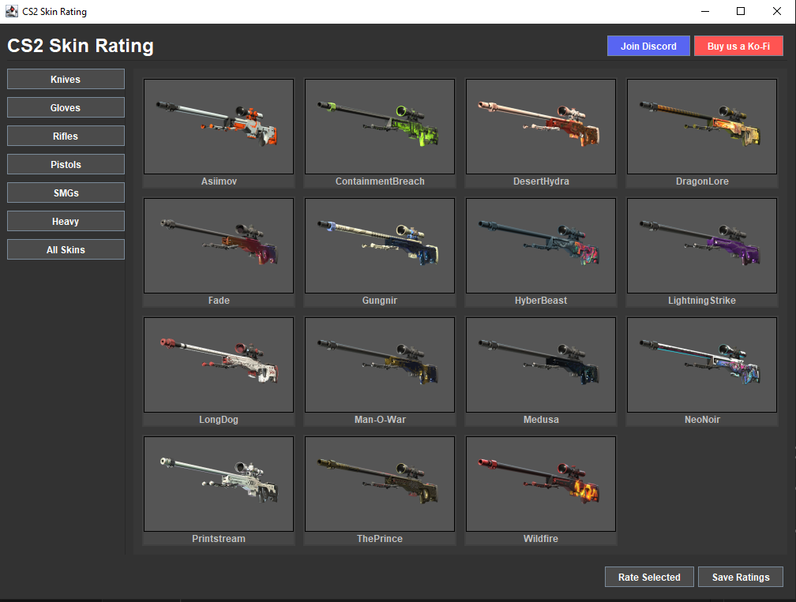

# CS2 Skin Rating GUI

This project is a Java Swing application designed to display and allow users to rate CS2 (Counter-Strike 2) weapon skins. It features a dark-themed user interface with a title bar, a sidebar for navigation (e.g., by weapon type), a central content area displaying skin images and names in a card layout, and a bottom panel for actions like rating or saving.

## Showcase



## Object-Oriented Programming (OOP) Concepts Utilized

The project, now structured across multiple Java files (located in the `src` directory: `src/CS2SkinRating.java`, `src/TopBarPanel.java`, `src/SidebarPanel.java`, `src/Button.java`, `src/CardDisplayPanel.java`, `src/SkinCard.java`, `src/BottomBarPanel.java`), demonstrates several key OOP concepts:

### 1. Classes and Objects

*   **Class:** A blueprint for creating objects.
    *   `src/CS2SkinRating.java`: The main application window class.
    *   `src/TopBarPanel.java`, `src/SidebarPanel.java`, `src/Button.java`, `src/CardDisplayPanel.java`, `src/SkinCard.java`, `src/BottomBarPanel.java`: Custom classes representing different UI sections or components. Each encapsulates its specific structure and behavior.
    *   Swing classes like `JFrame`, `JPanel`, `JButton`, `JLabel`, etc., are used extensively.
*   **Object:** An instance of a class.
    *   `new CS2SkinRating()`: Creates an instance of the main application window.
    *   `TopBarPanel topBarPanel = new TopBarPanel()`: Creates an instance of the `TopBarPanel`.
    *   `SkinCard card = new SkinCard(...)`: Creates an instance of a `SkinCard`.

### 2. Inheritance (IS-A Relationship)

*   **Concept:** A mechanism where a new class (subclass or derived class) inherits properties and methods from an existing class (superclass or base class).
*   **Example:**
    *   `public class CS2SkinRating extends JFrame`
        *   The `CS2SkinRating` class *is a* `JFrame`.
    *   `public class TopBarPanel extends JPanel` (and similarly for `CardDisplayPanel`, `SkinCard`, `BottomBarPanel`)
        *   These custom panel classes *are* `JPanel`s, inheriting JPanel's functionalities and adding specialized content and behavior.
    *   `public class SidebarPanel extends Button`
        *   The `SidebarPanel` class *is a* `Button`.
    *   `public class Button extends JPanel`
        *   The `Button` class *is a* `JPanel`.

### 3. Encapsulation

*   **Concept:** Bundling data (attributes) and methods (functions) that operate on the data within a single unit (a class). It also involves restricting direct access to some of an object's components.
*   **Example:**
    *   The `CS2SkinRating` class encapsulates instances of `TopBarPanel`, `SidebarPanel`, `JScrollPane` (which contains `CardDisplayPanel`), and `BottomBarPanel`.
    *   Each specialized panel class (e.g., `TopBarPanel`) encapsulates its own UI components (like `JLabel` for the title, `JButton`s for Discord/Ko-Fi) and the logic for their setup and layout. For instance, the creation and styling of the "Join Discord" button are handled entirely within `TopBarPanel`.
    *   The `SkinCard` class encapsulates the image label and name label for a single skin, along with the logic to load and display the image.

### 4. Abstraction

*   **Concept:** Hiding complex implementation details and showing only the essential features of an object. It helps in managing complexity by providing a simplified view.
*   **Example:**
    *   When you use `JButton button = new JButton("Click Me");`, you are interacting with an abstraction. You don't need to know how the button is drawn on the screen, how it handles mouse clicks at a low level, or how its text is rendered. You just use its methods like `setBackground()`, `setForeground()`, `addActionListener()`.
    *   The `JFrame` class itself abstracts the underlying windowing system of the operating system.
    *   The `CS2SkinRating` class, as a whole, provides an abstraction for a "skin rating application window."

### 5. Polymorphism (Many Forms)

*   **Concept:** The ability of an object to take on many forms. The most common use of polymorphism in OOP occurs when a parent class reference is used to refer to a child class object.
*   **Examples:**
    *   **Method Overriding:** While not explicitly overriding methods from `JFrame` in the provided constructor snippet (other than implicitly through its lifecycle), if `CS2SkinRating` were to override a method like `paintComponent` (more common for `JPanel`), that would be polymorphism.
    *   The `run()` method in the anonymous `Runnable` class:
        ```java
        SwingUtilities.invokeLater(new Runnable() {
            @Override // This annotation indicates overriding
            public void run() {
                new CS2SkinRating().setVisible(true);
            }
        });
        ```
        The `run()` method is defined in the `Runnable` interface, and the anonymous class provides a specific implementation for it.
    *   **Component Addition:** Methods like `mainPanel.add(component, constraint)` can accept any object that *is a* `Component` (e.g., `JPanel`, `JLabel`, `JButton`). The `add` method behaves polymorphically based on the actual type of component being added.

### 6. Composition (HAS-A Relationship)

*   **Concept:** Building complex objects by combining simpler objects. One object "has an" instance of another object.
*   **Example:**
    *   The `CS2SkinRating` (which is a `JFrame`) *has a* `TopBarPanel`, a `SidebarPanel`, a `JScrollPane` (which in turn *has a* `CardDisplayPanel`), and a `BottomBarPanel`.
        *   `mainPanel.add(topBarPanel, BorderLayout.NORTH);`
        *   `mainPanel.add(sidebarPanel, BorderLayout.WEST);`
    *   The `CardDisplayPanel` *has multiple* `SkinCard` objects.
        *   `add(card);` (within `CardDisplayPanel`'s loop)
    *   The `TopBarPanel` *has a* `JLabel` (`titleLabel`) and another `JPanel` (`topRightButtonsPanel`).
    *   This demonstrates how the main application window is composed of several distinct, manageable UI panel objects, each responsible for a part of the overall interface.

This application effectively uses these OOP principles to create a modular, maintainable, and extensible GUI structure.

## Compiling and Running from the Command Line

To compile and run this project from your command line or terminal:

1.  **Navigate to the Project Root:**
    Open your terminal or command prompt and navigate to the root directory of the project (e.g., `c:\Users\rifk\Desktop\OOP\SwingGui\`).

2.  **Compile the Java Files:**
    All Java source files are located in the `src` directory. Use the following command to compile them. The compiled `.class` files will also be placed in the `src` directory.
    ```bash
    javac src/*.java
    ```
    (On Windows, you might also use `javac src\*.java`)

3.  **Run the Application:**
    After successful compilation, run the main application class (`CS2SkinRating`). You need to specify the `src` directory in the classpath so that Java can find the compiled `.class` files.
    ```bash
    java -cp src CS2SkinRating
    ```

Make sure you have a Java Development Kit (JDK) installed and configured correctly on your system for these commands to work.